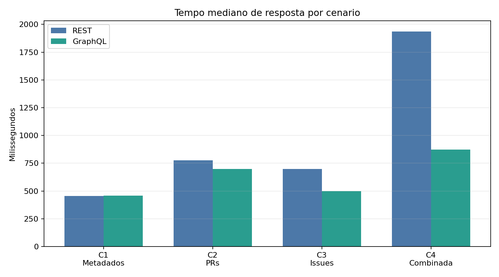
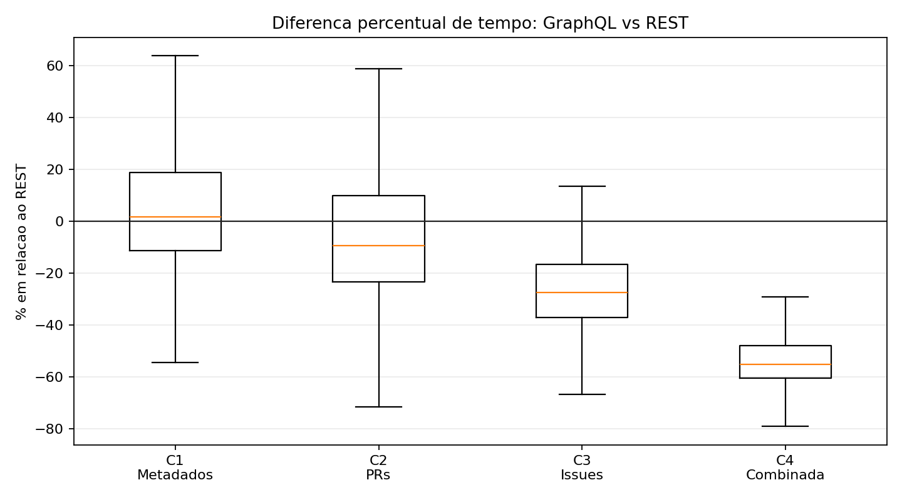
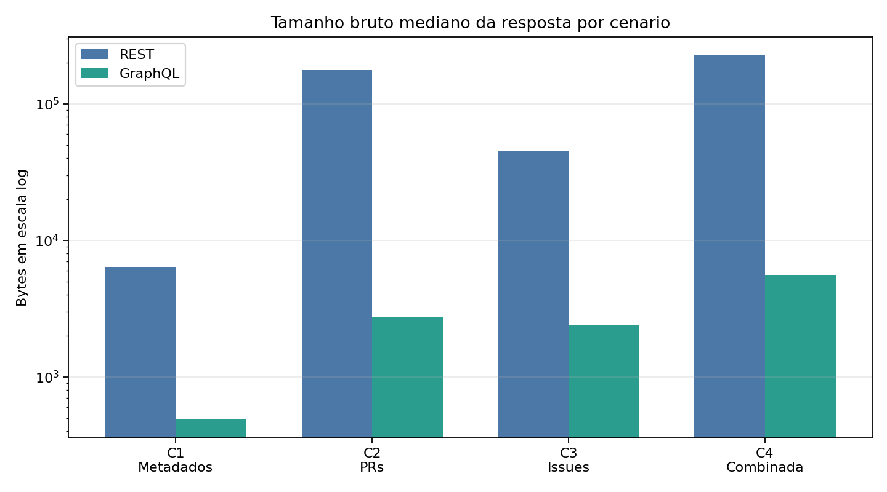
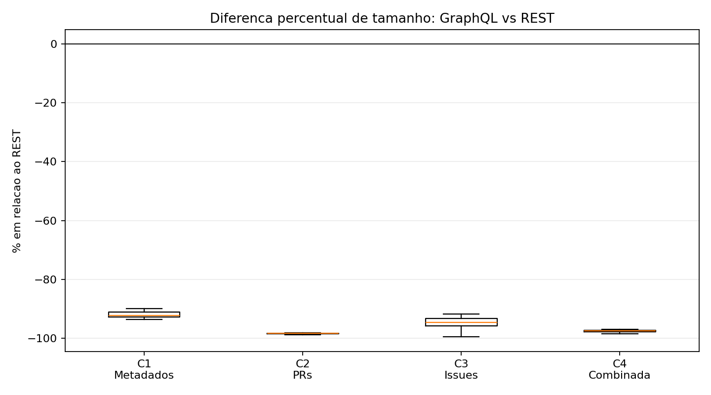

# Resultado final - Lab 05

## 1. Contexto da execucao

O experimento completo foi executado com a amostra definida no desenho experimental: os 100 repositorios Python mais populares do GitHub no momento da coleta. Para cada repositorio, foram avaliados 4 cenarios de consulta, com 30 repeticoes por cenario e por tecnologia.

Foram registradas 24.000 medicoes brutas em `enunciado5/output/measurements.csv`. Apos a preparacao dos dados, foram obtidos 11.998 pares validos REST/GraphQL de um total esperado de 12.000 pares. Apenas 3 medicoes falharam e foram descartadas da analise pareada principal.

| Item | Valor |
| --- | ---: |
| Repositorios planejados | 100 |
| Repositorios cobertos | 100 |
| Rodadas por repositorio/cenario | 30 |
| Medicoes brutas | 24.000 |
| Pares REST/GraphQL validos | 11.998 |
| Medicoes com falha | 3 |

As falhas registradas foram:

| API | Cenario | Status | Erro | Quantidade |
| --- | --- | ---: | --- | ---: |
| GraphQL | C1 | 401 | HTTP 401 | 1 |
| GraphQL | C3 | 0 | URLError | 1 |
| REST | C3 | 0 | URLError | 1 |

## 2. Artefatos gerados

| Artefato | Finalidade |
| --- | --- |
| `enunciado5/output/measurements.csv` | Medicoes brutas REST e GraphQL |
| `enunciado5/output/analysis/paired_measurements.csv` | Pares REST/GraphQL validos |
| `enunciado5/output/analysis/scenario_summary.csv` | Estatisticas descritivas por cenario |
| `enunciado5/output/analysis/wilcoxon_summary.csv` | Testes pareados de Wilcoxon |
| `enunciado5/output/analysis/failure_summary.csv` | Falhas descartadas da analise principal |
| `enunciado5/output/analysis/figures/` | Graficos finais para RQ1 e RQ2 |

Os cenarios analisados foram:

| Cenario | Descricao |
| --- | --- |
| C1 | Metadados do repositorio |
| C2 | Pull Requests recentes |
| C3 | Issues recentes |
| C4 | Consulta combinada: metadados + PRs + issues |

## 3. RQ1 - Tempo de resposta

RQ1: Respostas as consultas GraphQL sao mais rapidas que respostas as consultas REST?

| Cenario | Pares | Mediana REST (ms) | Mediana GraphQL (ms) | Delta mediano | Delta % | p-valor |
| --- | ---: | ---: | ---: | ---: | ---: | ---: |
| C1 | 2.999 | 454.852 | 459.910 | 7.715 | 1.700% | 0.00000027 |
| C2 | 3.000 | 777.238 | 698.718 | -69.667 | -9.413% | 0.00000000 |
| C3 | 2.999 | 697.606 | 499.460 | -186.001 | -27.437% | 0.00000000 |
| C4 | 3.000 | 1936.408 | 874.555 | -1043.854 | -55.136% | 0.00000000 |

### Interpretacao da RQ1

Os resultados mostram que GraphQL nao foi mais rapido em todos os cenarios. No cenario C1, que consulta apenas metadados simples do repositorio, GraphQL apresentou mediana ligeiramente maior que REST: 459,910 ms contra 454,852 ms. A diferenca e pequena em termos praticos, cerca de 7,715 ms ou 1,7%, mas aparece como estatisticamente significativa devido ao grande numero de pares.

Nos demais cenarios, GraphQL foi mais rapido:

- C2: reducao mediana de 69,667 ms, equivalente a 9,413%.
- C3: reducao mediana de 186,001 ms, equivalente a 27,437%.
- C4: reducao mediana de 1043,854 ms, equivalente a 55,136%.

O maior ganho aparece no cenario C4, em que REST precisa agregar tres requisicoes, enquanto GraphQL consegue recuperar metadados, Pull Requests e issues em uma unica query. Esse resultado sugere que a vantagem de GraphQL em tempo de resposta cresce quando a tarefa exige dados relacionados e evita multiplas chamadas REST.

Conclusao da RQ1: GraphQL foi mais rapido nos cenarios C2, C3 e C4, mas nao no cenario simples C1. Portanto, a evidencia final nao sustenta uma afirmacao universal de que GraphQL e sempre mais rapido; ela sustenta que GraphQL tende a ser mais rapido em consultas compostas ou com dados relacionados.

## 4. RQ2 - Tamanho da resposta

RQ2: Respostas as consultas GraphQL tem tamanho menor que respostas as consultas REST?

| Cenario | Pares | Mediana REST (bytes) | Mediana GraphQL (bytes) | Delta mediano | Delta % | p-valor |
| --- | ---: | ---: | ---: | ---: | ---: | ---: |
| C1 | 2.999 | 6.403 | 486 | -5.823 | -92.326% | 0.00000000 |
| C2 | 3.000 | 176.911 | 2.754 | -174.121 | -98.448% | 0.00000000 |
| C3 | 2.999 | 44.728 | 2.382 | -42.262 | -94.661% | 0.00000000 |
| C4 | 3.000 | 228.036 | 5.608,5 | -222.567 | -97.599% | 0.00000000 |

### Interpretacao da RQ2

GraphQL produziu respostas brutas substancialmente menores em todos os cenarios. As reducoes medianas ficaram sempre acima de 92%, chegando a 98,448% no cenario C2.

Esse resultado e coerente com a principal diferenca entre as abordagens. Em GraphQL, a query seleciona apenas os campos necessarios para o experimento. Em REST, os endpoints retornam muitos campos adicionais por padrao, o que aumenta o corpo bruto da resposta. Como o experimento mede bytes brutos retornados pela API, esse overfetching aparece diretamente na comparacao.

Conclusao da RQ2: Sim. Nos 100 repositorios analisados, GraphQL apresentou respostas brutas muito menores que REST em todos os cenarios, com diferencas estatisticamente significativas pelo teste pareado de Wilcoxon.

## 5. Resumo das respostas

| RQ | Resposta final |
| --- | --- |
| RQ1 | Parcialmente favoravel a GraphQL. GraphQL foi mais rapido em C2, C3 e C4, especialmente na consulta combinada, mas foi ligeiramente mais lento em C1. |
| RQ2 | Favoravel a GraphQL. GraphQL retornou respostas brutas muito menores em todos os cenarios analisados. |

## 6. Discussao

O experimento mostra que a principal vantagem observada de GraphQL foi a reducao do tamanho das respostas. Essa diferenca foi grande e consistente, independentemente do cenario. Para clientes que trafegam dados em redes limitadas ou que consultam APIs com grande quantidade de campos opcionais, essa reducao pode ser relevante.

Em relacao ao tempo de resposta, os resultados foram mais dependentes do cenario. Em uma consulta simples de metadados, REST e GraphQL ficaram muito proximos, com pequena vantagem para REST. Ja nos cenarios que envolvem listas de PRs, issues ou dados combinados, GraphQL apresentou melhor desempenho mediano. O caso mais forte foi o cenario C4, pois a abordagem REST exige tres chamadas para completar a mesma tarefa, enquanto GraphQL executa uma unica consulta.

Assim, os resultados indicam que GraphQL oferece beneficios mais claros quando a consulta precisa de dados relacionados ou quando e importante controlar exatamente quais campos serao retornados. Para consultas simples, a vantagem pode desaparecer ou ate se inverter levemente.

## 7. Ameacas a validade

Apesar da execucao completa, algumas ameacas permanecem. Os resultados foram obtidos apenas com a API do GitHub, portanto nao devem ser generalizados automaticamente para todas as APIs REST e GraphQL. Alem disso, a amostra considera os 100 repositorios Python mais populares, que podem ter caracteristicas diferentes de projetos menores ou de outras linguagens.

Tambem e importante observar que o tempo medido representa o custo percebido pelo cliente: inclui rede, latencia, processamento da API, serializacao e transferencia da resposta. Logo, ele nao representa apenas o tempo interno de processamento no servidor.

Por fim, as consultas GraphQL foram escritas para retornar apenas os campos necessarios, enquanto REST retorna os campos padrao de seus endpoints. Essa diferenca faz parte da comparacao pratica entre as abordagens, mas tambem explica por que a reducao de tamanho em GraphQL foi tao expressiva.

## 8. Conclusao

Com base em 24.000 medicoes brutas e 11.998 pares validos REST/GraphQL, conclui-se que GraphQL reduziu fortemente o tamanho bruto das respostas em todos os cenarios avaliados. Para tempo de resposta, GraphQL apresentou melhor desempenho nos cenarios de Pull Requests, issues e consulta combinada, mas nao na consulta simples de metadados.

Portanto, a adocao de GraphQL parece especialmente vantajosa quando o cliente precisa buscar dados relacionados, reduzir multiplas chamadas ou evitar overfetching. Em consultas simples, REST pode apresentar desempenho equivalente ou ligeiramente melhor.
